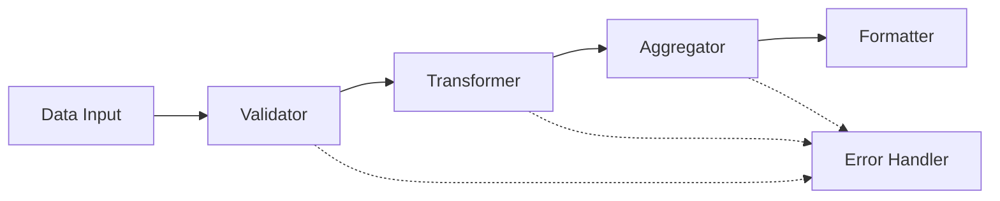

# Data Pipeline Example

This example demonstrates how to create a sophisticated data processing pipeline using configuration-driven MAS. It showcases advanced features like schema validation, data normalization, statistical aggregation, and formatted output.

## Overview

The pipeline processes numerical data through multiple stages:



## Agent Descriptions

### 1. Data Validator
- **Purpose**: Ensures data integrity and structure
- **Features**:
  - JSON Schema validation
  - Required field checking
  - Type validation
- **Configuration**:
  ```json
  {
    "input_validation": {
      "required_fields": ["data", "schema_version"],
      "schema": {
        "type": "object",
        "properties": {
          "data": {
            "type": "array",
            "items": {
              "type": "object",
              "properties": {
                "name": {"type": "string"},
                "value": {"type": "number"}
              }
            }
          }
        }
      }
    }
  }
  ```

### 2. Data Transformer
- **Purpose**: Normalizes numerical data
- **Features**:
  - Min-Max scaling
  - Z-score normalization
  - Configurable target range
- **Methods**:
  - `min_max`: Scales data to [0,1] range
  - `z_score`: Standardizes data (mean=0, std=1)
- **Configuration**:
  ```json
  {
    "transformation_type": "normalize",
    "normalization": {
      "method": "min_max",
      "target_range": [0, 1]
    }
  }
  ```

### 3. Data Aggregator
- **Purpose**: Computes statistical measures
- **Features**:
  - Group-based aggregation
  - Multiple aggregation methods
  - Flexible grouping keys
- **Methods**:
  - `mean`: Arithmetic average
  - `median`: Middle value
  - `sum`: Total sum
- **Configuration**:
  ```json
  {
    "aggregation": {
      "method": "mean",
      "group_by": "name"
    }
  }
  ```

### 4. Data Formatter
- **Purpose**: Formats output data
- **Features**:
  - JSON formatting
  - Metadata inclusion
  - Pretty printing
- **Configuration**:
  ```json
  {
    "output_format": "json",
    "include_metadata": true,
    "pretty_print": true
  }
  ```

## Input Data Format

The pipeline expects data in this format:
```json
{
  "data": [
    {
      "name": "temperature",
      "value": 25.5
    },
    {
      "name": "humidity",
      "value": 60.0
    }
  ],
  "schema_version": "1.0"
}
```

## Output Data Format

The pipeline produces output like this:
```json
{
  "aggregates": {
    "temperature": 25.5,
    "humidity": 60.0
  },
  "metadata": {
    "timestamp": "2025-02-11T12:08:43Z",
    "agent_id": "formatter_001",
    "format_version": "1.0"
  }
}
```

## Running Tests

1. **Basic Test**:
   ```bash
   python examples/data_pipeline/test_data_pipeline.py
   ```

2. **With Custom Data**:
   ```python
   from mas.workflow import WorkflowManager
   import json

   # Load config
   with open("config.json", "r") as f:
       config = json.load(f)

   # Create workflow
   workflow = WorkflowManager(config)

   # Process data
   result = workflow.start_workflow(
       "data_pipeline",
       {
           "data": [
               {"name": "score", "value": 85},
               {"name": "score", "value": 90}
           ],
           "schema_version": "1.0"
       }
   )
   ```

## Customization

### 1. Adding New Transformation Methods
```python
elif method == "custom":
    # Your custom transformation logic
    normalized = [custom_transform(v) for v in values]
```

### 2. Custom Aggregation Methods
```python
elif method == "custom_agg":
    aggregates[group_key] = custom_aggregate(values)
```

### 3. New Output Formats
```python
elif output_format == "custom":
    return custom_format(message)
```

## Best Practices

1. **Data Validation**
   - Always validate input data structure
   - Include schema version for future compatibility
   - Handle missing or invalid data gracefully

2. **Transformations**
   - Check for edge cases (e.g., zero variance)
   - Preserve original data alongside transformations
   - Document transformation methods clearly

3. **Aggregations**
   - Validate group keys exist
   - Handle empty groups appropriately
   - Consider numerical precision

4. **Error Handling**
   - Implement error stages for recovery
   - Log validation failures
   - Provide clear error messages

## Common Issues

1. **Missing Dependencies**
   ```bash
   pip install numpy jsonschema
   ```

2. **Schema Validation Errors**
   - Check data types match schema
   - Ensure required fields are present
   - Verify array item structures

3. **Transformation Errors**
   - Check for non-numeric values
   - Handle division by zero
   - Consider NaN/Inf values

## Advanced Usage

### 1. Custom Validation Rules
```python
def custom_validator(data):
    if not custom_condition(data):
        raise ValueError("Custom validation failed")
```

### 2. Pipeline Monitoring
```python
workflow.start_workflow(
    "data_pipeline",
    data,
    callbacks={
        "on_stage_complete": log_stage,
        "on_error": handle_error
    }
)
```

### 3. Dynamic Configuration
```python
config["agents"]["data_transformer"]["config"].update({
    "normalization": {
        "method": "z_score"
    }
})
```

## Contributing

1. Add new transformation methods
2. Implement additional aggregation functions
3. Create custom formatters
4. Improve error handling

## See Also

- [Main Documentation](../../README.md)
- [Agent Base Class](../../mas/agent.py)
- [Workflow Manager](../../mas/workflow.py)
